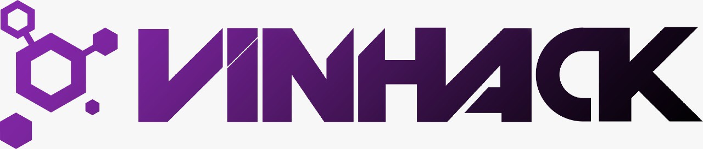

# VinHack - A Hackathon by [VinnovateIT](https://vinnovateit.com/)

> The official repository for VinHack, upcoming hackathon by VinnovateIT! **[Click here](https://vinhack.hackerearth.com/)** to register on Hackerearth.

Hacking is building things that you always wanted to have but no one has built it yet. It's to come up with an amazing idea and work tirelessly on it. It is to fail, fail again and fail better. Try out new things and learn while doing that. It's to work together, collaborate and build things that are innovative. It is to be a better programmer.

**With that spirit, [VinnovateIT](https://vinnovateit.com/) is conducting a hackathon, [VinHack](https://vinhack.hackerearth.com/) and invites all developers and hackathon enthusiasts to participate in an interesting and engaging hackathon.**

## Everyone is welcome!
Whether you’re writing your first lines of HTML, building a AR/VR app, VinHack is just the place for you. We will have mentors to help make your idea happen. You will be able to exhibit your skills without worrying about any mortal needs. We will take care of everything :)

## Why should you attend?

#### To make new friends
> **VinHack** provides a brilliant opportunity for you and your team to forge professional contacts and make new friends. With over 300 developers and designers gathering from all the engineering branches in [VIT Vellore](http://www.vit.ac.in/), grab your chance of connecting with people to discuss ideas and opportunities.

#### To learn
> Hackathons are a great way to give back to the community. Mentoring beginners is always helpful for them and rewarding for us. We’re going to have mentors from a number of different organizations present at the venue. Whenever you’re stuck on a problem or need suggestions they'll always be within a hand’s reach.

#### To build
> We are inviting everyone to build on ideas of their choice. Watching software materialize from pure thought, part by part is the closest to experiencing magic we have ever got to. And we’re excited to see that magic happen all over again!

## More Info

| Start Date & Time  | *8:00 AM, 22nd March*  |
|---|---|
| **End Date & Time**  | ***9:30 PM, 23rd March***  |
| **Team Size**  | **Min - 2 & Max - 5**  |
| **Venue**  | **SJT, VIT Vellore**  |

## Registration

**[Click here](https://vinhack.hackerearth.com/)** to register on Hackerearth.

## FAQs

    
<strong>Do I need to have any specific qualifications to be a participant for the Hackathon?</strong>

If you love to code, you are more than welcome to participate in the Hackathon.

 

    
<strong>What is the cost of the hackathon?</strong>

It's 100/- each individual.

 

    
<strong>Can I register individual?</strong>

Yes! If you don't team, we'll team up during the hackathon.

 

    
<strong>How do I submit what I have made for the Hackathon? </strong>

You have to submit your source code on our GitHub repository.

   

    
<strong>Do we need to have the entire idea fully working? </strong>

The entire idea need not be fully implemented however, the submission should be functional so that it can be reviewed by the judges.

 

    
<strong>Does the entire team have to be available for the entire duration of the Hackathon?  </strong>

No, anyone member should be present all the time. The team should be present for the pitching round.

 

    
<strong>Does the entire team have to be available for the entire duration of the Hackathon?  </strong>

No, anyone member should be present all the time. The team should be present for the pitching round.

## Cash Prizes

- First Prize - ***INR 5000/-***
- Second Prize - ***INR 3000/-***
- Third Prize - ***INR 2000/-***

> There will be swags for all the participants!

## Code Reviewers

- [Vinit Shahdeo](https://github.com/vinitshahdeo)
- [Shagun Khemka](https://github.com/S2606)
- [Shreya Anand](https://github.com/ShreyaAnand)

## Stay Updated!

Like our **[Facebook](https://www.facebook.com/VinnovateIT/)** page to keep yourself updated. We'd love to see **[#VinHack]()** on your timeline.

### Hope to see you there!

