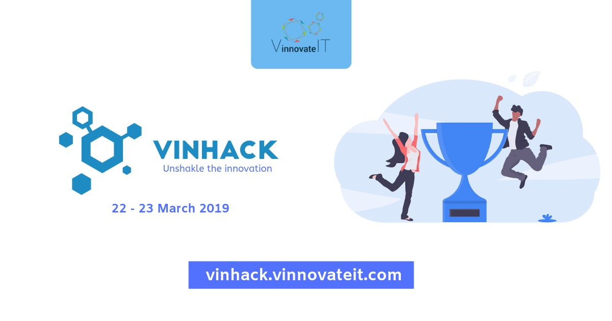

[](https://vinhack.vinnovateit.com/)
# VinHack - A Hackathon by [VinnovateIT](https://vinnovateit.com/)

[](https://vinhack.hackerearth.com/)
[](https://vinnovateit.com/)

```

 __     ___       _   _            _    
 \ \   / (_)_ __ | | | | __ _  ___| | __
  \ \ / /| | '_ \| |_| |/ _` |/ __| |/ /
   \ V / | | | | |  _  | (_| | (__|   < 
    \_/  |_|_| |_|_| |_|\__,_|\___|_|\_\
                                        

```

> The official repository for VinHack, upcoming hackathon by VinnovateIT! **[Click here](https://vinhack.hackerearth.com/)** to register on Hackerearth.Check the [official website](https://vinhack.vinnovateit.com/) of **VinHack!**

Hacking is building things that you always wanted to have but no one has built it yet. It's to come up with an amazing idea and work tirelessly on it. It is to fail, fail again and fail better. Try out new things and learn while doing that. It's to work together, collaborate and build things that are innovative. It is to be a better programmer.

**With that spirit, [VinnovateIT](https://vinnovateit.com/) is conducting a hackathon, [VinHack](https://vinhack.hackerearth.com/) and invites all developers and hackathon enthusiasts to participate in an interesting and engaging hackathon.**

## Everyone is welcome!
Whether you’re writing your first lines of HTML, building a AR/VR app, VinHack is just the place for you. We will have mentors to help make your idea happen. You will be able to exhibit your skills without worrying about any mortal needs. We will take care of everything :)

## Why should you attend?
[](https://vinhack.hackerearth.com/)

#### To make new friends
> **VinHack** provides a brilliant opportunity for you and your team to forge professional contacts and make new friends. With over 300 developers and designers gathering from all the engineering branches in [VIT Vellore](http://www.vit.ac.in/), grab your chance of connecting with people to discuss ideas and opportunities.

#### To learn
> Hackathons are a great way to give back to the community. Mentoring beginners is always helpful for them and rewarding for us. We’re going to have mentors from a number of different organizations present at the venue. Whenever you’re stuck on a problem or need suggestions they'll always be within a hand’s reach.

#### To build
> We are inviting everyone to build on ideas of their choice. Watching software materialize from pure thought, part by part is the closest to experiencing magic we have ever got to. And we’re excited to see that magic happen all over again!


## More Info

[](https://vinhack.hackerearth.com/)

| Start Date & Time  | *8:00 AM, 22<sup>nd</sup> March*  |
|---|---|
| **End Date & Time**  | ***9:30 PM, 23<sup>rd</sup> March***  |
| **Team Size**  | **Min - 2 & Max - 5**  |
| **Venue**  | **SJT, VIT Vellore**  |

## Registration

[](https://vinhack.hackerearth.com/)

**[Click here](https://vinhack.hackerearth.com/)** to register on Hackerearth.

## FAQs
[](https://vinhack.hackerearth.com/)


<details open>
    <summary><strong>Do I need to have any specific qualifications to be a participant for the Hackathon?</strong></summary>
If you love to code, you are more than welcome to participate in the Hackathon.
</details>
<br>
<details open>
    <summary><strong>What is the cost of the hackathon?</strong></summary>
It's 100/- each individual.
</details>
<br>
<details open>
    <summary><strong>Can I register individual?</strong></summary>
Yes! If you don't team, we'll team up during the hackathon.
</details>
<br>
<details open>
    <summary><strong>How do I submit what I have made for the Hackathon? </strong></summary>
You have to submit your source code on our GitHub repository.
</details>
<br>  
<details open>
    <summary><strong>Do we need to have the entire idea fully working? </strong></summary>
The entire idea need not be fully implemented however, the submission should be functional so that it can be reviewed by the judges.
</details>
<br>
<details open>
    <summary><strong>Does the entire team have to be available for the entire duration of the Hackathon?  </strong></summary>
No, anyone member should be present all the time. The team should be present for the pitching round.
</details>
<br>
<details open>
    <summary><strong>Does the entire team have to be available for the entire duration of the Hackathon?  </strong></summary>
No, anyone member should be present all the time. The team should be present for the pitching round.
</details>

## Cash Prizes

[](https://vinhack.hackerearth.com/)

- First Prize - ***INR 5000/-***
- Second Prize - ***INR 3000/-***
- Third Prize - ***INR 2000/-***

> There will be swags for all the participants!

## Few useful resources

### Awesome boilerplates

[](https://github.com/vinitshahdeo)

Curated list of boilerplates and templates to enhance productivity.

- [Awesome Projects Boilerplates](#awesome-projects-boilerplates)
    - [Android Development](#android-development)
    - [iOS Development](#ios-development)
    - [JavaScript](#javascript)
    - [Hybrid Mobile App Frameworks](#hybrid-mobile-app-frameworks)
    - [Python](#python)
    - [PHP](#php)
    - [Ruby](#ruby)
    - [.NET](#net)
    - [Go](#go)
    - [Browser Webextensions](#browser-webextensions)
    - [Websites](#websites)


### Android Development

*Boilerplates and templates for Android*

- [Android Bootstrap](https://github.com/AndroidBootstrap/android-bootstrap) A template/bootstrap/boilerplate application that includes tons of great open source tools and frameworks.
- [Android Material Drawer Template](https://github.com/kanytu/android-material-drawer-template) An Android template with navigation drawer for material design.
- [material-design-icons-adt-template](https://github.com/intrications/material-design-icons-adt-template) Android Studio / Eclipse ADT template for material-design-icons resources.
- [AndroidKickststarter](https://github.com/e-biz/androidkickstartr) Framework kickstarts development which help you focus on coding.
- [Android Annotations](https://github.com/excilys/androidannotations) Fast Android Development. Easy maintainance.
- [Android Cookbook Examples](https://github.com/IanDarwin/Android-Cookbook-Examples) Collected code examples from the O'Reilly Android Cookbook.
- [Android Basic Samples](https://github.com/playgameservices/android-basic-samples) Mostly game oriented samples.
- [Android Webview Sample App](https://github.com/tscolari/android-webview-sample-app) Webview Sample App
- [Android Quickstart](https://github.com/googledrive/android-quickstart) Quickstart application showing the Google Drive API for Android.
- [Beginning Android Resources](https://github.com/codepath/android_guides/wiki/Beginning-Android-Resources) Android Guide.
- [Universal Music Player](https://github.com/googlesamples/android-UniversalMusicPlayer) Google sample application that shows how to implement an audio media app that works across multiple form factors and provides a consistent user experience on Android phones, tablets, Auto, Wear and Cast devices.
- [Android Architecture Blueprints](https://github.com/googlesamples/android-architecture) Demonstrates a basic Model-View-Presenter architecture and showcases various TODO app implementations.

### IOS Development.

*Boilerplates and templates for IOS*

- [iOS Boilerplate](https://github.com/gimenete/iOS-boilerplate) Boilerplate by Gimeno.
- [Amaro](https://github.com/crushlovely/Amaro) Featureful iOS Boilerplate.
- [Boilerplate-iOS](https://github.com/openaphid/Boilerplate-iOS) Boilerplate by openaphid.

### JavaScript

*Boilerplates and templates for JavaScript*

- [Yeoman](https://github.com/yeoman) The web's scaffolding tool for modern webapps. Includes many generators to get started.
- [Mega Boilerplate](https://github.com/sahat/megaboilerplate) Fullstack boilerplate generator with support for Node.js, a static site, or an Electron app. 
- [NodeJS](#node-js)
    - [Yeoman Node Generator](https://github.com/yeoman/generator-node) Yeomans node generator   
    - [Node Module boilerplate](https://github.com/sindresorhus/node-module-boilerplate) Boilerplate to kickstart creating a node module
    - [Express Boilerplate](https://github.com/expressjs/generator) Boilerplate generator for Express.js Projects
    - [Hackathon Starter](https://github.com/sahat/hackathon-starter) A boilerplate for Node.js web applications.
    - [Node/Backbone Web App Boilerplate](https://github.com/skaapgif/webapp-boilerplate) Boilerplate for web applications with a Node, Express, MongoDB backend and Backbone Marionette, Jade, Require.js frontend.
    - [Nodebootstrap](http://nodebootstrap.io/) Unobtrusive skeleton project for Node/Express.js with pre-configured best-practices.
    - [Vue-Express-Mongo Boilerplate](https://github.com/icebob/vue-express-mongo-boilerplate) - Full stack JS web app boilerplate with Express, Mongo and VueJS.
- [AngularJS](#angular-js)
    - [ng-boilerplate](https://github.com/ngbp/ngbp) An opinionated kickstarter for AngularJS projects.
    - [Yeoman Angular Generator](https://github.com/yeoman/generator-angular)
    - [Angular Laravel CouchDB](https://github.com/melvin0008/laravel-angular) Angular Laravel CouchDB Boilerplate
- [ReactJS](#react-js)
    - [React Boilerplate](https://github.com/petehunt/react-boilerplate) Boilerplate for creating a React npm package
    - [React Boilerplate](https://github.com/rackt/react-boilerplate) React boilerplate with React Router and webpack
    - [React Transform Boilerplate](https://github.com/gaearon/react-transform-boilerplate) A new Webpack boilerplate with hot reloading React components, and error handling on module and component level.
    - [Library Boilerplate](https://github.com/gaearon/library-boilerplate) An opinionated boilerplate for React libraries including ESLint, Mocha, Babel, Webpack and an example powered by Webpack Dev Server and React Hot Loader
    - [React NPM Component Starter](https://github.com/yogaboll/react-npm-component-starter) A minimal boilerplate for building a React component for NPM
    - [React Isomorphic Starterkit](https://github.com/RickWong/react-isomorphic-starterkit) Isomorphic starterkit with server-side React rendering having many features
    - [Coffee React Quickstart ](https://github.com/KyleAMathews/coffee-react-quickstart) Quickstart for building React single page apps using Coffeescript, Gulp, Webpack, and React-Router
    - [Flask React Boilerplate](https://github.com/alexkuz/flask-react-boilerplate) Flask and react Boilerplate
    - [Boilerplate Webpack React](https://github.com/tcoopman/boilerplate-webpack-react) Boilerplate project for Reactjs with webpack, gulp and stylus
    - [React JS Hot loader Boilerplates](https://github.com/gaearon/react-hot-loader/tree/master/docs#starter-kits) React hot loader starter kits
    - [React Redux minimal](https://github.com/flexdinesh/react-redux-boilerplate) A minimal React-Redux boilerplate with all the best practices
    - [React Redux Universal Hot Example](https://github.com/erikras/react-redux-universal-hot-example) A starter boilerplate for a universal webapp using express, react, redux, webpack, and react-transform
    - [post3ree-boilerplate](https://github.com/hex22a/post3ree-boilerplate) Boilerplate for a universal application using 3REE stack (React, Redux, RethinkDB, Express) + PostCSS
- [HyperApp](#hyperapp)
    - [hyperapp-boilerplate](https://github.com/tzellman/hyperapp-boilerplate) Boilerplate showing how to create a production-ready Hyperapp application.
- [Backbone](#backbone)
    - [Backbone Boilerplates](https://github.com/addyosmani/backbone-boilerplates) Backbone Boilerplates by Addy Osmani.
    - [Yeoman Backbone Generator](https://github.com/yeoman/generator-backbone) Yeoman generator for Backbone.
    - [benm](https://github.com/shorttompkins/benm) Boilerplate web app using Backbone.js, ExpressJS, node.js, MongoDB.
- [Jquery](#jquery)
    - [Generator Jquery Boilerplate](https://github.com/jquery-boilerplate/generator-jquery-boilerplate) Yeoman Generator for jQuery Boilerplate.
- [Polymer](#polymer)
    - [Polymer Starter Kit](https://github.com/PolymerElements/polymer-starter-kit) A starting point for Polymer 1.0 apps.
    - [Polymer Seed Element](https://github.com/PolymerElements/seed-element) An element providing a starting point for your own reusable Polymer elements.
    - [Yeoman Polymer Generator](https://github.com/yeoman/generator-polymer) Yeoman's polymer Generator
- [Electron](#electron)
    - [Electron Boilerplate](https://github.com/sindresorhus/electron-boilerplate) Boilerplate for electron-node
    - [WhiteStormJS - React/Redux - three.js - TypeScript boilerplate](https://github.com/WhitestormJS/whitestorm-typescript-boilerplate) A starter kit for crafting 3D applications using modern technologies

### Hybrid Mobile App Frameworks

- [Angular Gulp Ionic Boilerplate](https://github.com/MaximAbramchuck/angular-gulp-ionic-boilerplate) Ionic framework boilerplate for writing apps using Gulp and EcmaScript6.


### Python

*Boilerplates and templates for Python*
- [Django Hackathon Starter](https://github.com/DrkSephy/django-hackathon-starter) A boilerplate for Django web applications, providing various social logins and several popular API examples.
- [CookieCutter](https://github.com/audreyr/cookiecutter#python) List of various python templates by Audrey.
- [bootstrapy](https://github.com/kirang89/bootstrapy) A bootstrap Python application, so that you can focus on writing code.
- [Fbone](https://github.com/imwilsonxu/fbone) Fbone (Flask bone) is a Flask (Python microframework) template/bootstrap/boilerplate application.
- [hasura/hello-python-flask](https://hasura.io/hub/project/hasura/hello-python-flask) A boilerplate Flask application which can be deployed in 3 mins, with ready-to-use database, authentication and file APIs.
- [Flask-Bootstrap](https://github.com/esbullington/flask-bootstrap) A Flask app template with integrated SQLAlchemy, authentication, and Bootstrap frontend.
- [Flask Boilerplate](https://github.com/melvin0008/FlaskBoilerplate) A very simple flask boilerplate with folder structures.
- [Flask Foundation](https://github.com/JackStouffer/Flask-Foundation) App built with best practices.
- [GoogleAppEngine Webapp2 Boilerplate](https://github.com/coto/gae-boilerplate) A Complete boilerplate for Python Webapp2 on Google App Engine
- [Flask Appengine Template](https://github.com/kamalgill/flask-appengine-template) Flask App engine Template
- [Django Starter Template](https://github.com/fasouto/django-starter-template) An easy to use project template for Django that follows best practices.
- [gae-init](http://gae-init.appspot.com) Google App Engine based on Flask, RESTful, Bootstrap and tons of other cool features.
- [CherryPy + Mako + Formish + OOOP boilerplate](https://github.com/kdeldycke/cherrypy_mako_formish_ooop_boilerplate) Targets publishing of OpenERP content to the web.


### PHP

*Boilerplates and templates for PHP*

- [Laravel Angular CouchDB](https://github.com/melvin0008/laravel-angular) Laravel Angular CouchDB Boilerplate

### Ruby

*Boilerplates and templates for Ruby*

- [AngularJS Rails Templates](https://github.com/pitr/angular-rails-templates) Rails and Angular Tempate.  
- [AngularJS Sinatra Bootstrap](https://github.com/dannolan/angularjs-sinatra-bootstrap-template) Angular Sinatra Bootstrap template.
- [Rails Composer](http://railsapps.github.io/rails-composer/) Use Rails Composer to generate any of the example applications from the RailsApps project.
- [Rails Bootstrap](https://github.com/RailsApps/rails-bootstrap) Starter App for Rails and Bootstrap

### .NET

*Boilerplates and templates for C#.NET and ASP.NET*

- [ASP.NET Boilerplate](https://github.com/aspnetboilerplate/aspnetboilerplate) ASP.NET Boilerplate is a starting point for new modern web applications using best practices and most popular tools.


### Go

*Boilerplates and templates for Go*

- [Go React JSX Boilerplate](https://github.com/sharath/go-react-boilerplate) Starter code for a React + Go web application


### Browser Webextensions

*Boilerplates and templates to develop webextensions for internet browsers such as Chrome, Firefox and Safari*

- [Boilerplate with Webpack](https://github.com/fstanis/webextensions-webpack-boilerplate) Using Webpack JS module manager


### Websites

*Boilerplates and templates for Websites*
- [HTML5 Boilerplate](https://html5boilerplate.com/) Web's most popular front-end template
- [Meteor boilerplate](https://github.com/Differential/meteor-boilerplate) Boilerplate for meteor framework.
- [Web Starter Kit](https://github.com/google/web-starter-kit) Web starter kit by Google.
- [Open Designs](http://www.opendesigns.org/) Open Source WebDesign Templates
- [Open Web Design](http://www.openwebdesign.org/) Community of designers and site owners sharing free web design templates
- [OSWD](http://www.oswd.org/) Platform for sharing standards-compliant free web design templates
- [Jekyll Starter Kit](https://github.com/nirgn975/generator-jekyll-starter-kit) Jekyll Progressive Web App generator boilerplate.
- [HTML5 UP!](https://html5up.net/) Responsive HTML5 and CSS3 Site Templates.
- [Gulp front](https://zoxon.github.io/gulp-front/) Frontend boilerplate and framework based on gulp, pug, stylus and babel

## Documentation

**Backend**

- [express-generator](https://www.npmjs.com/package/express-generator) 
- [SocketIO](https://socket.io/docs/)
- [PassportOauth2](http://www.passportjs.org/docs/)
- [PyFlask Documentation](http://flask.pocoo.org/docs/1.0/tutorial/)


**App Development**

- [retrofit](https://square.github.io/retrofit/)
- [volley](https://developer.android.com/training/volley/)
- [fast-Android-Networking](https://github.com/amitshekhariitbhu/Fast-Android-Networking)
- [FireBase Authentication](https://firebase.google.com/docs/auth/android/custom-auth)
- [Flutter](http://flutter.io/docs)

**Cloud Services**

- [DigitalOcean](http://digitalocean.com/)
- [AWS EC2](https://aws.amazon.com/ec2/)
- [Heroku](https://www.heroku.com/)

**Frontend**

- [React BoilerPlate](https://github.com/react-boilerplate/react-boilerplate/tree/master/docs) 
- [MaterializeCSS](https://materializecss.com/)

**AI and ML**

- [Pytorch](https://pytorch.org/docs/stable/index.html)
- [Tensorflow](https://www.tensorflow.org/guide)
- [Keras](https://keras.io/)
- [OpenCV](https://docs.opencv.org/2.4/doc/tutorials/tutorials.html)

**UI and UX Design**

MAC
- [Sketch](https://www.sketchapp.com/docs/)

**Windows**

- [UI Design Kit](https://www.adobe.com/in/products/xd/ui-design-kits.html)
- [Material Design Kit](https://materialdesignkit.com/)
- [Webflow](https://webflow.com/)
- [Google PWA](https://developers.google.com/web/progressive-web-apps/)


## Code Reviewers

[](https://github.com/vinitshahdeo)

- [Vinit Shahdeo](https://github.com/vinitshahdeo)
- [Shagun Khemka](https://github.com/S2606)
- [Shreya Anand](https://github.com/ShreyaAnand)

## Sponsors

| [MoveInSync](https://www.moveinsync.com/)  | [HackerEarth](https://www.hackerearth.com/)  | [Bugsee](https://www.bugsee.com/)  | [Coding Blocks](https://codingblocks.com/)   |
|---|---|---|---|
|   |   |   |   |

## Stay Updated!

Like our **[Facebook](https://www.facebook.com/VinnovateIT/)** page to keep yourself updated. We'd love to see **[#VinHack]()** on your timeline.

### Hope to see you there!

```

  _    _            _     __          ___ _   _       _    _     _ 
 | |  | |          | |    \ \        / (_) | | |     | |  | |   | |
 | |__| | __ _  ___| | __  \ \  /\  / / _| |_| |__   | |  | |___| |
 |  __  |/ _` |/ __| |/ /   \ \/  \/ / | | __| '_ \  | |  | / __| |
 | |  | | (_| | (__|   <     \  /\  /  | | |_| | | | | |__| \__ \_|
 |_|  |_|\__,_|\___|_|\_\     \/  \/   |_|\__|_| |_|  \____/|___(_)
                                                                   
                                                                   

```

[](https://github.com/vinitshahdeo) [](https://github.com/vinitshahdeo)
